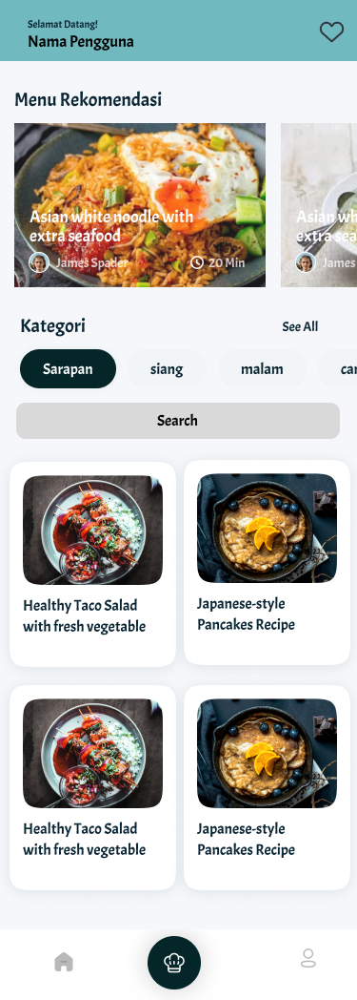

# 🍲 Food Recipes Mobile App

Aplikasi Android yang menyediakan berbagai resep makanan lengkap dengan gambar, bahan, dan cara pembuatan. 
Dirancang dengan tampilan modern, dikelola melalui CMS, dan menggunakan Firebase sebagai basis data real-time.

---

## 📱 Fitur Utama

- Menampilkan daftar resep makanan yang dapat diperbarui dari CMS
- Kategori resep: makanan utama, cemilan, minuman, dll
- Pencarian resep berdasarkan nama atau bahan
- Gambar resep dan detail deskripsi
- Favoritkan resep untuk disimpan
- Firebase Realtime Database / Firestore untuk penyimpanan data resep
- CMS berbasis web untuk input dan update resep

---

## 🛠️ Teknologi yang Digunakan

| Komponen       | Teknologi                                  |
|----------------|---------------------------------------------|
| Frontend App   | Android Studio (Java/Kotlin, XML)          |
| Backend CMS    | Web-based CMS (PHP/Node.js/Flask, dsb.)    |
| Database       | Firebase Realtime Database / Firestore     |
| Autentikasi    | Firebase Authentication                    |
| UI/UX Design   | Figma                                       |
| Manajemen Proyek | Trello                                    |

---

## 📌 Penjelasan Proyek

Aplikasi ini dirancang untuk memberikan kemudahan kepada pengguna dalam menemukan resep makanan secara cepat dan menarik. 
Data resep dapat dikelola sepenuhnya melalui CMS oleh admin tanpa perlu update aplikasi secara manual.

Dengan integrasi Firebase, aplikasi dapat memuat resep secara real-time dan menyimpan data favorit pengguna. 
Desain UI mengikuti prinsip minimalis dan user-friendly berdasarkan prototipe di Figma. Trello digunakan untuk mengatur task dan progres selama pengembangan.

---

## 🔗 Link Proyek

- 🎨 [Desain UI/Ux di Figma](https://www.figma.com/design/U5Xt31iWHtsIlumyWy47Vj/Mobile_Recipes?node-id=64-1760&p=f&t=R4LpldI4Gv3b9DMj-0)
- ▶️ [Demo YouTube](https://youtu.be/e4Ca13SA-oQ)
- 📋 [Manajemen Proyek di Trello 1](https://trello.com/b/ERhCDkA9/mobile-project)
- 📋 [Manajemen Proyek di Trello 2](https://trello.com/b/HZuh5Tyn/project-mobile)
- 📋 [Manajemen Proyek di Trello 3](https://trello.com/b/xkyXtSbo/project-mobile)
- 📋 [Manajemen Proyek di Trello 4](https://trello.com/b/Ed8bURZo/project-mobile)

---

## 🧱 Design UI/UX Preview

  
  
  
  
  
  
  
  
  

